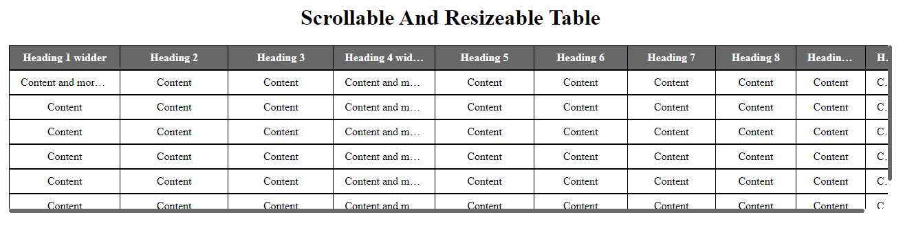

> # Portfolio

| Project Veiw Screenshots|
|---------------------------------------|
|

|

# 📗 Table of Contents

- [📖 About the Project](#about-project)
  - [🛠 Built With](#built-with)
    - [Tech Stack](#tech-stack)
    - [Key Features](#key-features)
  - [🚀 Live Demo](#live-demo)
- [💻 Getting Started](#getting-started)
  - [Setup](#setup)
  - [Prerequisites](#prerequisites)
  - [Usage](#usage)
- [👥 Authors](#authors)
- [🔭 Future Features](#future-features)
- [🤝 Contributing](#contributing)
- [⭐️ Show your support](#support)
- [📝 License](#license)

# 📖 [Scrollable-and-Resizeable-Table] 

> **[Scrollable-and-Resizeable-Table]** This repository provides a solution for creating a scrollable and resizable table using HTML, CSS, and JavaScript. The table allows users to resize columns by dragging the column headers and scroll both horizontally and vertically to view large datasets. The implementation ensures consistent behavior in column resizing, even when the table width changes or columns are toggled.

## 🛠 Built With 

### Tech Stack 

  
Client

  <ul>
    <li><a href="#">HTML</a></li>
    <li><a href="#">CSS</a></li>
    <li><a href="#">JAVASCRIP</a></li>
  </ul>

### Key Features 
- **[Vertical scrolling within the table container]**
- **[Horizontal scrolling to view all columns]**
- **[Resizable columns by dragging the column headers]**
- **[Proportional column resizing to maintain table layout]**
- **[Compatibility with various table widths and column visibility changes]**

(<a href="#readme-top">back to top</a>)

## 🚀 Live Demo 

> - [Live Demo On Gh-pages](https://akbarsazish.github.io/scrollable-and-resizeable-table/)

(<a href="#readme-top">back to top</a>)

## 💻 Getting Started 

To get a local copy up and running, follow these steps.

### Prerequisites

In order to run this project you need:
- Clone on your local system.
- On your browser open the HTML file.

### Setup

Clone this repository to your desired folder:

- Use the following Commands:

      cd your-desired-folder
      git clone https://github.com/akbarsazish/scrollable-and-resizeable-table.git

### Usage
To use the scrollable and resizable table, simply include the provided HTML structure, CSS styles, and JavaScript functionality in your web application. The table can be customized by modifying the HTML content, CSS styles, and JavaScript code to fit your specific requirements

(<a href="#readme-top">back to top</a>)

## 👥 Authors 

👤 **Ali Akbar Sazish**

- GitHub: [@githubhandle](https://github.com/akbarsazish)
- Twitter: [@twitterhandle](https://twitter.com/AliAkbarSazish1)
- LinkedIn: [LinkedIn](https://www.linkedin.com/in/ali-akbar-sazish/)

(<a href="#readme-top">back to top</a>)

## 🔭 Future Features 
- [ ] **[Responsiveness with the all kind of laptop and handheld devices viewport]**

(<a href="#readme-top">back to top</a>)

## 🤝 Contributing 

Contributions, issues, and feature requests are welcome!

Feel free to check the [issues page](../../issues/).

(<a href="#readme-top">back to top</a>)

## ⭐️ Show your support 

Contributions to this repository are welcome. If you encounter any issues or have suggestions for improvements, please feel free to submit a pull request or open an issue on the repository's GitHub page.

(<a href="#readme-top">back to top</a>)

## 📝 License 

This project is [MIT](./LICENSE) licensed.

(<a href="#readme-top">back to top</a>)

